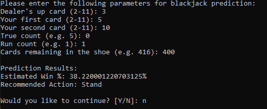
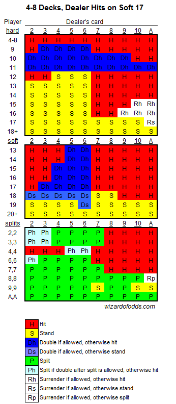

# Blackjack Predictor using XGBoost

This project implements a machine learning model using **XGBoost** to predict a player's **win percentage** against the dealer's up card in **Blackjack**, and recommends the **optimal action** to take , replicating the *Perfect Strategy* used by professional players and card counters. Enjoy! 

---

## Demo Video

Watch the YouTube Demo:  
[https://www.youtube.com/watch?v=NimHpAx_hWY](https://www.youtube.com/watch?v=NimHpAx_hWY)

This video shows the model in action, including how it takes input (dealer up card, player hand, true count) and outputs the win percentage and optimal move.

---

## Project Highlights

- **Win Probability Prediction**: Predicts the likelihood of a player's starting hand beating the dealer’s up card.
- **Perfect Strategy Recommender**: Suggests the optimal action (Hit, Stand, Double, etc.) according to professional Blackjack strategy.
- **Data-Driven**: Trained on 20 million Blackjack hands (20 million Blackjack hands), with casino rules and conditions.
- **Model**: Built using the XGBoost classifier.

---

## Blackjack Rules Overview

Summary of the core rules and terminology. The dataset and model are based on common Las Vegas casino rules, which influence strategy decisions:

- **Objective:**  
  Beat the dealer by having a hand value closer to 21 without exceeding it (busting).

- **Card Values:**  
  - Number cards (2–10) count as their face value.  
  - Face cards (J, Q, K) count as 10.  
  - Aces count as 1 or 11, whichever benefits the hand most. In the event where an Ace can count as 1 or 11, the total value of the hand is known as a "Soft [value of hand]". 
  - ie. A5 is known as a Soft 16.

- **Gameplay:**  
  - Each player starts with two cards; the dealer shows one card face up (the "up card").  
  - Players decide to:  
    - **Hit:** Take another card.  
    - **Stand:** Keep current hand.  
    - **Double Down:** Double the initial bet and receive exactly one more card.  
    - **Split:** If the first two cards are the same, split into two hands.  
    - **Surrender:** Forfeit half the bet and end the hand (late surrender allowed in this dataset).  
  - Dealer rules:  
    - Dealer hits on "soft 17" (a hand with an Ace valued as 11 totaling 17).

- **Payouts:**  
  - Blackjack (Ace + 10-value card) pays 3:2.

---

### Data Exploration and Preprocessing Strategy

A comprehensive exploratory data analysis was performed to rigorously characterize the statistical properties and interdependencies within the dataset. Key observations informed a deliberately minimalistic preprocessing approach tailored to the unique characteristics of blackjack gameplay data:

- The dataset contains critical continuous features such as **True Count** and **Shoe Number**, which encapsulate temporal and contextual information fundamental to strategic decision-making in blackjack.
- Conventional data balancing techniques such as **SMOTE** or synthetic oversampling, while effective in many classification tasks, were deemed unsuitable here. Applying such methods would artificially interpolate new samples, thereby **disrupting inherent feature correlations and sequence-dependent structures**, and introducing spurious patterns inconsistent with actual gameplay dynamics.
- Maintaining the integrity of the raw data distribution was essential to preserve the fidelity of the feature interactions and avoid biasing the model with synthetic artifacts.

This approach preserves the continuous structure of blackjack gameplay data such as card count sequences and true count dynamics when designing preprocessing steps, since disrupting these domain-specific correlations would compromise the model’s ability to accurately replicate the mathematically precise strategies fundamental to optimal blackjack play.

### Model Evaluation and Rationale for Choosing XGBoost

Multiple supervised learning algorithms were evaluated to identify the optimal predictive framework capable of modeling the complex, nonlinear relationships inherent in blackjack strategy optimization:

- **Random Forests**: Ensemble tree-based methods offering robustness and interpretability. In testing, Random Forests showed limitations in capturing subtle interaction effects between continuous features with sufficient granularity, and exhibited longer training times.
  
- **Deep Neural Networks (DNNs)**: Although DNNs excel at modeling complex feature hierarchies, their application here presents challenges:
  - Necessitate extensive hyperparameter tuning and risk overfitting due to the relatively low dimensionality and structured nature of the features.
  - Overcomplication due to fine-tuning activation function (i used elu for this), for minor improvements in accuracy which is irrelevant in this example due to the hard ceiling of model performance(Mathematically-proven perfect strategy)

- **XGBoost (Extreme Gradient Boosting)**: This gradient-boosted decision tree framework delivered an optimal balance of **predictive performance, computational efficiency, and explainability**. Its advantages include:
  - L1/L2 regularization mechanisms mitigating overfitting.
  - Ability to inherently handle mixed continuous and categorical variables.
  - Fast training leveraging parallel and distributed computing.
  - Built-in tools for feature importance and SHAP value explanations, enabling clear insight into model decision processes.

Critically, the finalized XGBoost model attained a **remarkable 98% efficacy**, effectively replicating the mathematically proven **Perfect Strategy** employed by expert blackjack players and card counters. This near-perfect alignment confirms the model’s capacity to generalize domain rules without overfitting or reliance on excessive complexity.

Consequently, the marginal gains from deploying a deep neural architecture do not justify the added complexity, opacity, and resource demands. The XGBoost solution represents a **best-in-class synthesis of accuracy, robustness, and transparency**, perfectly suited for this specialized application.

---

## Dataset

- **Source**: [Blackjack Hands on Kaggle](https://www.kaggle.com/datasets/dennisho/blackjack-hands)
- **Filename**: `blackjack_simulator.csv`

### Dataset Details
Simulated using a realistic blackjack engine based on standard Las Vegas rules:
- 8-deck shoe (6.5 deck penetration)
- Dealer hits soft 17
- Blackjack pays 3:2
- Double down allowed on any first 2 cards
- Double after split allowed
- Split same cards up to 4 hands
- No resplitting Aces
- Aces receive one extra card only (no blackjack)
- Late surrender allowed (not after split)

### Card Representation
- 10s, Jacks, Queens, Kings → `10`
- Aces → `11` (always, regardless of soft/hard usage)
- Suits are not recorded
- True count and run count recorded using Hi-Lo system
- Actions taken:
  - `H`: Hit  
  - `S`: Stand  
  - `D`: Double Down  
  - `P`: Split  
  - `R`: Surrender  
  - `I`: Buy Insurance (never used)  
  - `N`: No Insurance

---

## Getting Started

### Installation

1. **Clone the repository**:
    ```bash
    git clone https://github.com/your-username/blackjack_predictor_XGBoost.git
    cd blackjack_predictor_XGBoost
    ```

2. **Install required packages**:
    ```bash
    pip install -r requirements.txt
    ```

3. **Run the predictor**:
    ```bash
    python blackjack_predictor.py
    ```

---

## Model Overview

- **Inputs**:
  - Dealer up card
  - Player's first card
  - Player's second card
  - True count
  - Run count
  - Cards remaining in shoe

- **Outputs**:
  - Win probability (float)
  - Recommended move (str): e.g., Hit, Stand, Double, etc.

- **Algorithm**:  
  - [XGBoost](https://xgboost.readthedocs.io/en/stable/)

---

## Project Structure

| File | Description |
|------|-------------|
| **`blackjack_model_taka.ipynb`** | Contains machine-learning pipeline: data exploration, preprocessing, model definition, training using XGBoost, and SHAP-based model explainability. |
| **`predict_blackjack.py`** | Loads the pre-trained models and serves as the main interface to predict the player's win percentage and recommend the optimal move based on game state. |

---

## Example Output


## Multi Deck Perfect Strategy - Mathematically derived optimal move


---

## Upcoming Features & Planned Improvements

This project is actively being developed. Below are some planned enhancements to improve functionality, usability, and automation:

### Model Intelligence
- [ ] Continuous Learning with Feedback Loop  
  Enable the model to adapt over time by learning from user decisions and outcomes (reinforcement-style feedback).

- [ ] Multi-Move Prediction  
  Allow the model to predict and recommend a sequence of optimal moves (e.g., for the next 2–3 turns).

- [ ] Risk to Reward Tolerance Threshold  
  Add a configurable parameter to adjust the playstyle of the model, allowing users to specify how much deviation from the perfect expected value (EV) strategy they prefer.

### User Interface
- [ ] Graphical User Interface (GUI)  
  Build a desktop-friendly GUI for easy use without command-line interaction.

### Real-Time Automation
- [ ] Live Table Input from Online Casino Footage  
  Integrate visual recognition (e.g., using OpenCV) to extract card values from real poker table footage.

- [ ] Automated Card Counting  
  Continuously track visible cards and maintain an updated true count without manual input.

### Real-Time Game Analysis (Displayed on GUI)
- [ ] Dealer’s Range Estimation  
  Display the predicted range of the dealer’s hidden hand based on current visible cards and card count.

- [ ] Win Probability Display  
  Show the player's real-time win percentage directly on the GUI interface.

---